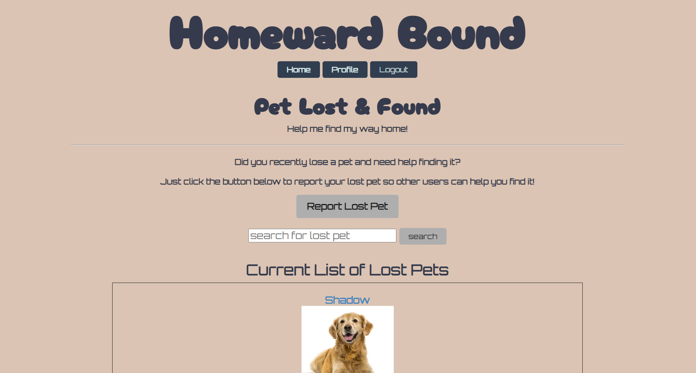
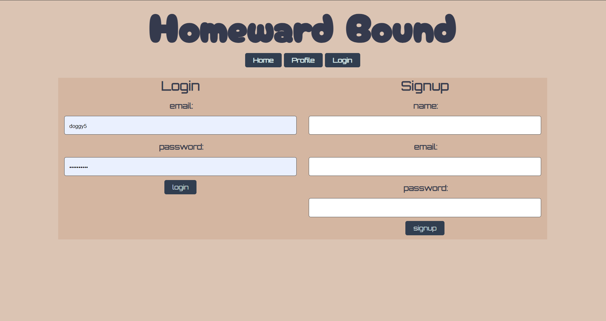
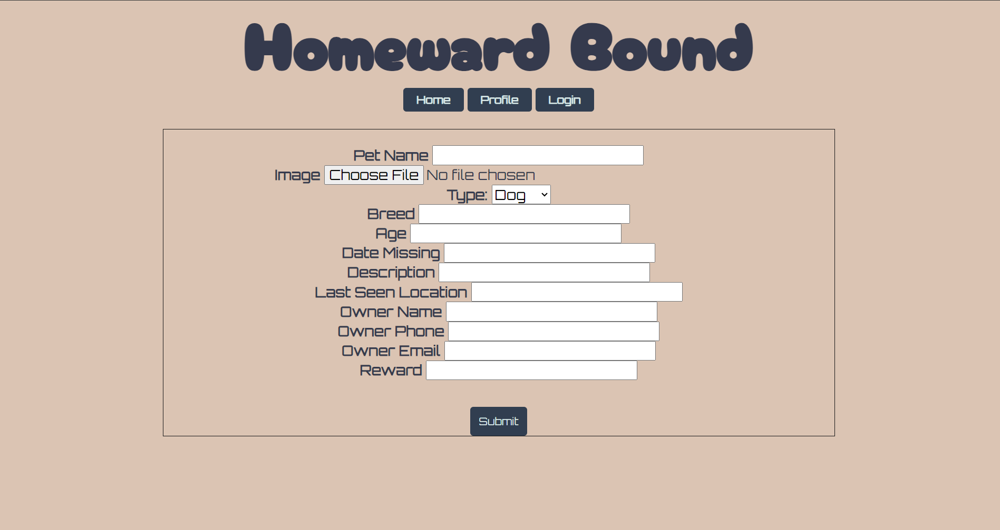
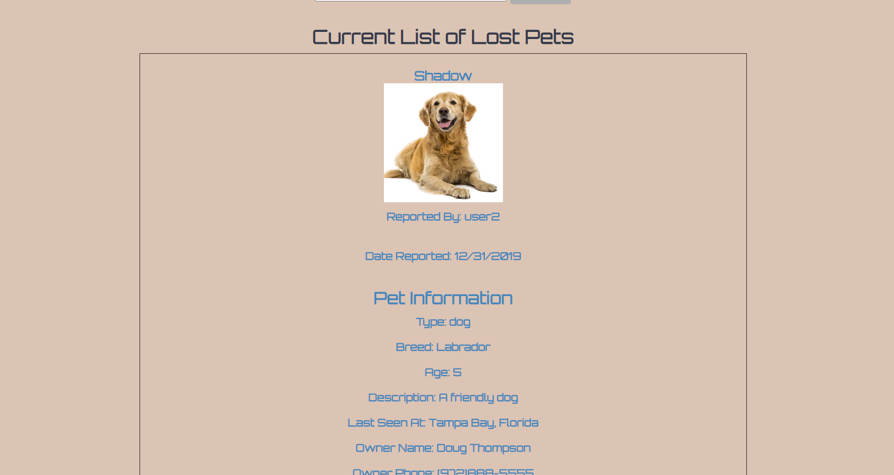

# Homeward Bound

## Technologies Used

## Table of Contents

\*[license](#license)

\*[title](#title)

\*[usage](#usage)

\*[livelink](#livelink)

\*[screenshots](#screenshots)

\*[description](#description)

\*[installation](#installation)

\*[tests](#tests)

\*[contributing](#contributing)

\*[challenge](#challenge)

\*[github](#github)

\*[email](#email)

## License

This project is licensed under the MIT license.
https://opensource.org/licenses/MIT

## Title

Homeward Bound

## Usage

To help lost pets find their way home.

## LiveLink
https://warm-fortress-51039.herokuapp.com/

## Screenshots

## Description
Lost a pet?  Users Can sign-in or create a log-in if it is their first time visiting. You can then post lost pets for others to see and keep and eye out for your lost pet.
You can post detail descriptions, locations and rewards about your pet so that we all can help them return home safe.  If you find a pet, you can post a found pet and contact the owner to return the pet home.  If you are a shelter, you can post pets that are up for adoption.  You can also post pets that have been adopted so that others know they have found a home.  If you are a shelter, you can post pets that are up for adoption.  You can also post pets that have been adopted so that others know they have found a home.  If you are a shelter, you can post pets that are up for adoption.  You can also post pets that have been adopted so that others know they have found a home.  If you are a shelter, you can post pets that are up for adoption.  You can also post pets that have been adopted so that others know they have found a home.  If you are a shelter, you can post pets that are up for adoption.  You can also post pets that have been adopted so that others know they have found a home.  If you are a shelter, you can post pets that are up for adoption.  You can also post pets that have been adopted so that others know they have found a home.  If you are a shelter, you can post pets that are up for adoption.  You can also post pets that have been adopted so that others know they have found a home.  If you are a shelter, you can post pets that are up for adoption.  You can also post pets that have been adopted so that others know they have found a home.

## Installation
Clone the repo, install the dependencies, and run `npm start` to start the server.  Navigate to `localhost:3001` in your browser to view the application. If you want to see the live version, click the link above.

## Tests

## Contributing
[]
(https://www.contributor-covenant.org/)

Jen Wariner

Antoine Michels

 Jerrick Johnson
 
  Jason Weaver

  With Assistance from:Tyler Calvert, and TA Austin Miller

## Challenge

## GitHub
https://github.com/JenWariner19/homeward-bound

## Email
Jason-jamaweaver@yahoo.com
Antoine-antoinedmichels@gmail.com
Jerrick-jerrickjohnson88@gmail.com
Jen-wariner-jenniferwariner@yahoo.com

## Questions

